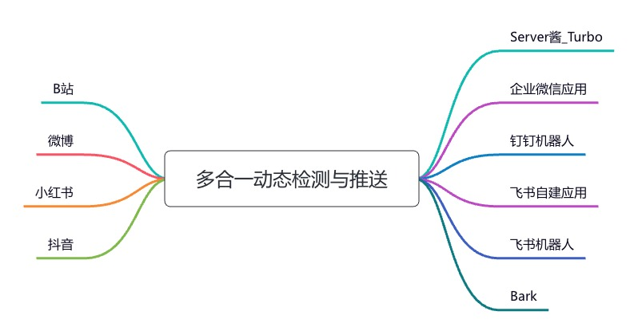

# All-in-one Dynamic Push - 多合一动态检测与推送

## 简介

一款整合多平台`动态/直播开播提醒`检测与推送的小工具，目前支持以下平台：

- [x] B站
- [x] 微博
- [x] 小红书
- [x] 抖音

## 工作流程



## Docker（推荐的部署方式）

[](https://hub.docker.com/r/nfew/aio-dynamic-push)

```sh
# 下载并修改配置文件 config.yml
# 启动
docker run -d -v [配置文件的绝对路径]/config.yml:/mnt/config.yml nfew/aio-dynamic-push:latest
```

## 配置文件 config.yml 说明

(1)`common`下的参数

- 项目的一些公共参数

(2)`query_task`下的参数

- 支持配置多项不同的任务，并为不同的任务配置不同的推送通道

(3)`push_channel`下的参数

- 支持配置多种推送通道

## 运行环境

- [Python 3](https://www.python.org/)

## 直接启动

#### 1. 填写config.yml配置信息

#### 2.安装第三方库

`pip install -r requirements.txt -i https://pypi.tuna.tsinghua.edu.cn/simple/`

#### 3.启动脚本

`nohup python3 -u main.py >& aio-dynamic-push.log &`

## 声明:

- 本仓库发布的`aio-dynamic-push`项目中涉及的任何脚本，仅用于测试和学习研究，禁止用于商业用途
- `nfe-w` 对任何脚本问题概不负责，包括但不限于由任何脚本错误导致的任何损失或损害
- 以任何方式查看此项目的人或直接或间接使用`aio-dynamic-push`项目的任何脚本的使用者都应仔细阅读此声明
- `nfe-w` 保留随时更改或补充此免责声明的权利。一旦使用并复制了任何相关脚本或`aio-dynamic-push`项目，则视为已接受此免责声明
- 本项目遵循`MIT LICENSE`协议，如果本声明与`MIT LICENSE`协议有冲突之处，以本声明为准
