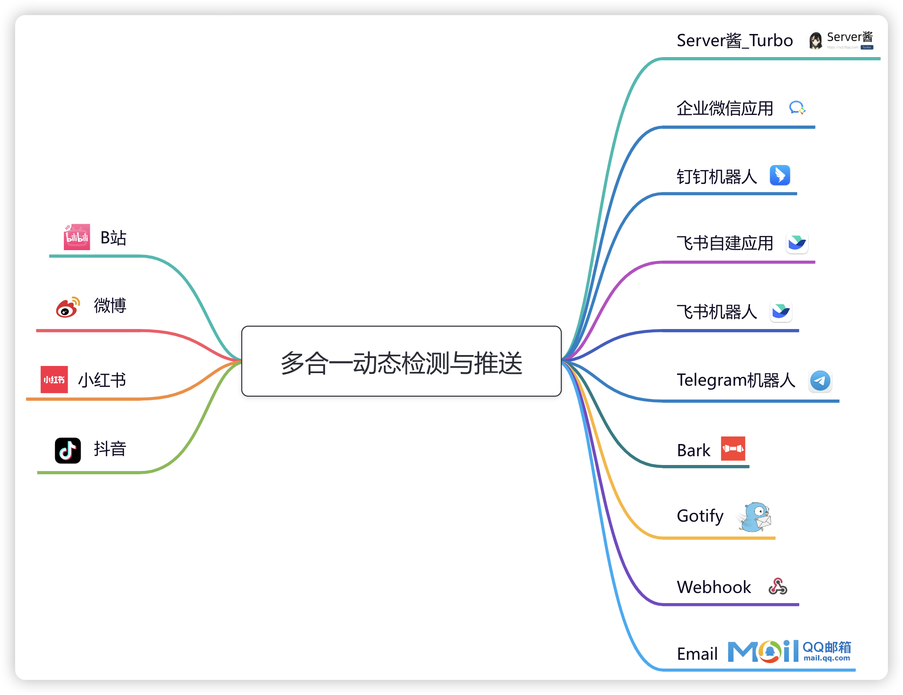

# All-in-one Dynamic Push - 多合一动态检测与推送

[](https://hub.docker.com/r/nfew/aio-dynamic-push)
[](https://hub.docker.com/r/nfew/aio-dynamic-push)
[](https://hub.docker.com/r/nfew/aio-dynamic-push)
[](https://www.python.org/downloads)
[](https://github.com/astral-sh/uv)
[](https://github.com/nfe-w/aio-dynamic-push/actions)
[](https://github.com/nfe-w/aio-dynamic-push/blob/master/LICENSE)


## 简介

一款整合多平台`动态/直播开播提醒`检测与推送的小工具，目前支持以下平台：

- [x] B站
- [x] 微博
- [x] 小红书
- [x] 抖音
- [x] 斗鱼
- [x] 虎牙

## 工作流程



## Docker（推荐的部署方式）

[](https://hub.docker.com/r/nfew/aio-dynamic-push)

```sh
# 下载并修改配置文件 config.yml
# 启动
docker run -d -v [配置文件的绝对路径]/config.yml:/mnt/config.yml nfew/aio-dynamic-push:latest
```

## 配置文件 [config.yml](./config.yml) 说明

(1)`common`下的参数

- 项目的一些公共参数

(2)`query_task`下的参数

- 支持配置多项不同的任务，并为不同的任务配置不同的推送通道

| 任务类型 | type     | 动态检测 | 开播检测 |
|------|----------|:----:|:----:|
| B站   | bilibili |  ✅   |  ✅   |
| 微博   | weibo    |  ✅   |  ❌   |
| 小红书  | xhs      |  ✅   |  ❌   |
| 抖音   | douyin   |  ❌   |  ✅   |
| 斗鱼   | douyu    |  ❌   |  ✅   |
| 虎牙   | huya     |  ❌   |  ✅   |

(3)`push_channel`下的参数

- 支持配置多种推送通道

| 通道类型          | type             | 推送附带图片  | 说明                                                                                                          |
|---------------|------------------|:-------:|-------------------------------------------------------------------------------------------------------------|
| Server酱_Turbo | serverChan_turbo |    ❌    | 🤖方便，不用安装app，免费用户5次/天，适合频率不高的用户<br/>👉https://sct.ftqq.com                                                  |
| 企业微信自建应用      | wecom_apps       |    ✅    | 😢新用户不再推荐，2022年6月20日之后新创建的应用，需要配置可信IP<br/>👉https://work.weixin.qq.com/wework_admin/frame#apps/createApiApp |
| 企业微信群聊机器人     | wecom_bot        |    ✅    | 🥳推荐，新建群聊添加自定义机器人即可<br/>👉https://developer.work.weixin.qq.com/document/path/99110                          |
| 钉钉群聊机器人       | dingtalk_bot     |    ✅    | 🥳推荐，新建群聊添加自定义机器人即可，自定义关键词使用"【"<br/>👉https://open.dingtalk.com/document/robots/custom-robot-access         |
| 飞书自建应用        | feishu_apps      |    ✅    | 🤔可以使用个人版，创建应用，授予其机器人权限<br/>👉https://open.feishu.cn/app?lang=zh-CN                                         |
| 飞书群聊机器人       | feishu_bot       | ❌(暂不支持) | 🤩推荐，新建群聊添加自定义机器人即可，自定义关键词使用"【"<br/>👉https://open.feishu.cn/document/client-docs/bot-v3/add-custom-bot     |
| Telegram机器人   | telegram_bot     |    ✅    | 🪜需要自备网络环境<br/>👉https://core.telegram.org/bots                                                             |
| QQ频道机器人       | qq_bot           |    ✅    | 😢需要自行创建机器人，并启用机器人在频道内发言的权限<br/>👉https://q.qq.com/#/app/create-bot                                         |
| Bark          | bark             |    ❌    | 🍎适合苹果系用户，十分轻量，但没法推送图片<br/>👉https://apps.apple.com/cn/app/id1403753865                                     |
| Gotify        | gotify           |    ❌    | 🖥️适合自建服务器<br/>👉https://gotify.net                                                                         |
| Webhook       | webhook          | ✅(POST) | ⚡️通用的方式，请求格式详见附录                                                                                            |
| 电子邮件          | email            |    ✅    | 📧通用的方式                                                                                                     |

## 开发说明

推荐使用 [uv](https://github.com/astral-sh/uv) 运行

- 新增查询任务：详见 `query_task/query_demo.py`
- 新增推送通道：详见 `push_channel/demo.py`

## 运行环境

- [Python 3](https://www.python.org/)

## 直接启动

#### 1. 填写config.yml配置信息

#### 2.安装第三方库

`pip install -r requirements.txt -i https://pypi.tuna.tsinghua.edu.cn/simple/`

#### 3.启动脚本

`nohup python3 -u main.py >& aio-dynamic-push.log &`

## 附录

### Webhook 支持的请求格式

#### GET 请求

```http request
GET https://xxx.api.com?title={{title}}&content={{content}}
```

#### POST 请求

```http request
POST https://xxx.api.com
Content-Type: application/json

{
  "query_task_config": {
    "name": "任务名称",
    "enable": true,
    "type": "bilibili/weibo/xhs/douyin",
    "intervals_second": 600,
    "begin_time": "00:00",
    "end_time": "23:59",
    "target_push_name_list": [
      "推送通道名称"
    ],
    "enable_living_check": false,
    "enable_dynamic_check": true
  },
  "dynamic_raw_data": {
    "key1": "value1",
    "key2": "value2"
  }
}
```

## 声明:

- 本仓库发布的`aio-dynamic-push`项目中涉及的任何脚本，仅用于测试和学习研究，禁止用于商业用途
- `nfe-w` 对任何脚本问题概不负责，包括但不限于由任何脚本错误导致的任何损失或损害
- 以任何方式查看此项目的人或直接或间接使用`aio-dynamic-push`项目的任何脚本的使用者都应仔细阅读此声明
- `nfe-w` 保留随时更改或补充此免责声明的权利。一旦使用并复制了任何相关脚本或`aio-dynamic-push`项目，则视为已接受此免责声明
- 本项目遵循`MIT LICENSE`协议，如果本声明与`MIT LICENSE`协议有冲突之处，以本声明为准
